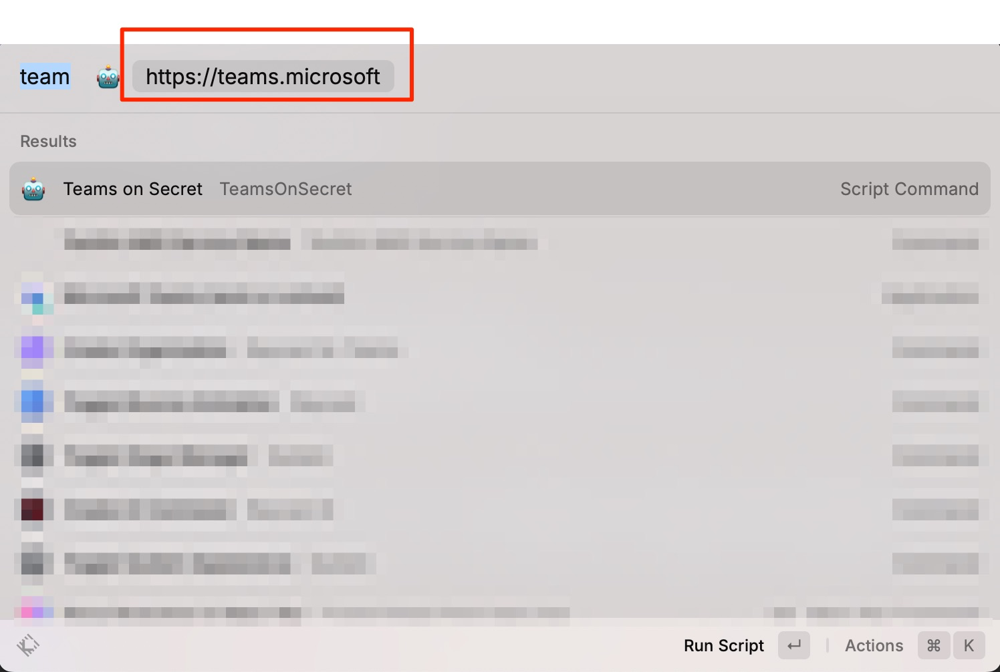
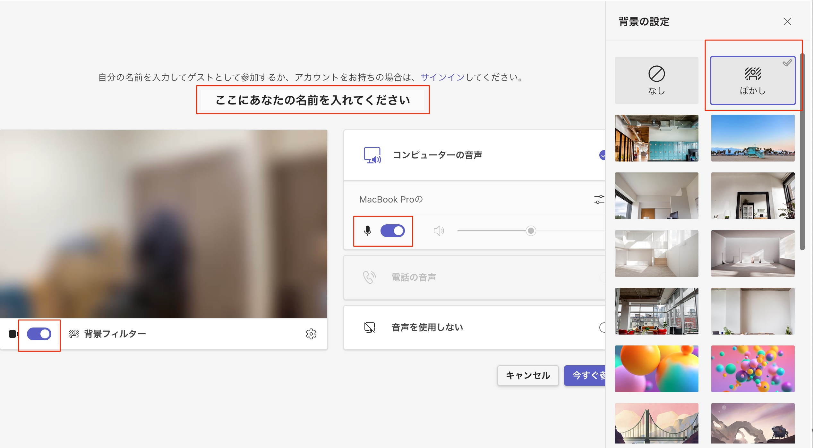

# teamsOnSecret Command

## 背景

- 複数のTeams組織に所属している
    - 例えば複数のお客様とやり取りをして、いずれも別の組織にゲストユーザーとして招待いただいている
- オンラインMTG時に組織外のユーザーでも参加できる会議URLを共有いただくことがよくある
- その際、事故防止のため以下のような手順を毎回行っている
    - ブラウザでTeams会議を開く
    - 名前を入力する
    - ビデオ・マイクをオンにする
    - 背景をぼかす
- これら手順を省略するため、RayCast上で以下のように招待されたTeamsのURLを入力することで、名前の入力や背景ぼかしを自動入力するスクリプトを作成しました

## 利用方法のイメージ

- Raycastから`Teams on Secret` のコマンドを呼び出してください
- `Teams会議のURLを入力`と書かれるテキストボックスに招待されたTeamsnのURLを入力してください

- エンターを押下することでシークレットウインドウでChromeブラウザが開き、各種入力を自動化してくれます
    - 赤枠で囲った部分を自動入力・自動で有効化します

## Raycastからコマンドを実行できるようになるまで

- 本リポジトリを任意の場所に`git clone` してください
- クローンしたディレクトリに`cd`で移動してください
- `npm install` を実行してください
    - 実行後に`node_modules` ディレクトリが作成されていることを確認してください
- `npx playwright install` コマンドを実行して、ブラウザ操作自動化に必要な依存関係をインストールしてください
- src/browserOperation.ts の `ここにあなたの名前を入れてください` という場所にTeams会議で表示したい名前を入力してください
- `npx tsc` もしくは `npm run build` を実行してアプリケーションをビルドしてください
    - `dist` ディレクトリにjsファイルが作成されればOKです
- [raycast/script-commands](https://github.com/raycast/script-commands?tab=readme-ov-file#install-script-commands-from-this-repository)の`Install Script Commands from this repository` を参考にして、今作業をしているディレクトリを`Add Script Directory` してください
